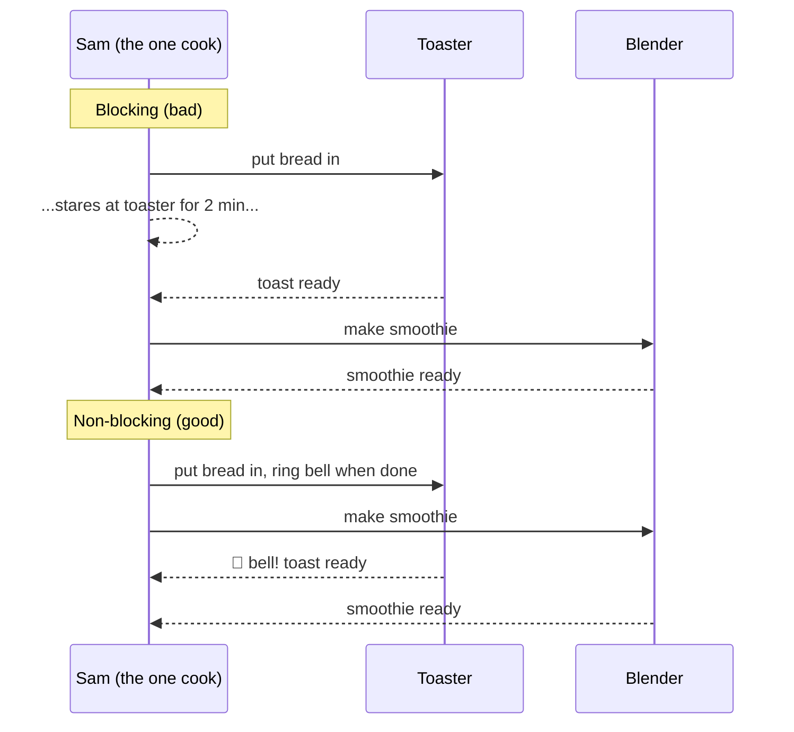
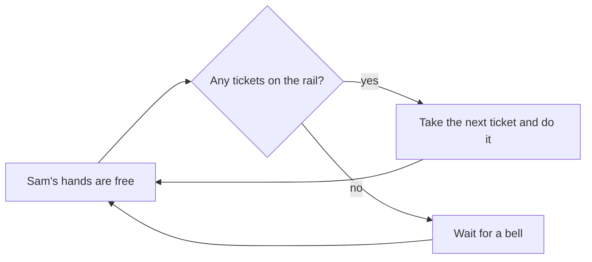

# Lesson 1: Waiting Is Normal

## The big idea

**JavaScript is a kitchen with exactly one cook.** Lots of things in a program involve waiting:
for a file, for the internet, for a timer. If the cook just stands there staring at the oven,
nothing else in the kitchen gets done. So JavaScript has a trick for waiting without freezing.

## The story

Picture a food truck with one cook, Sam. An order comes in: **toast and a smoothie**.

The **wrong** way (we call this *blocking*): Sam puts bread in the toaster, then stands in front of it
with arms crossed for two minutes. Then makes the smoothie. Total time: toaster time plus blender time.
Customers behind are annoyed. The truck looks frozen.

The **right** way (*non-blocking*, or *asynchronous*): Sam puts bread in the toaster, and the toaster
has a bell. Sam walks away and starts the smoothie. When the bell rings, Sam grabs the toast.
Sam never did two things at the same instant. Sam just never stood still.

That bell is the whole secret. The cook says: *"Toaster, when you're done, ring the bell, and I'll come back."*
In code, the "come back and do this" part is called a **callback**.

## The picture



How does Sam know the bell rang? Sam has a **ticket rail**. Every time a bell rings, a ticket goes on the rail:
"toast is ready, go butter it." Whenever Sam's hands are free, Sam takes the next ticket.
Programmers call this ticket rail the **event loop**. You do not need to remember that name today.
You need to remember: *one cook, a rail of tickets, hands never idle.*



## The tiniest code

```ts
console.log("1. put bread in")

setTimeout(() => {
  console.log("3. 🔔 toast ready")   // this runs LATER, when the bell rings
}, 2000)

console.log("2. make smoothie")     // this runs RIGHT AWAY, Sam didn't wait
```

Run it and the numbers come out in order: 1, 2, then 3 two seconds later.
The function inside `setTimeout` is the ticket Sam left for later. That's a callback.

## Check yourself

1. Sam is one person. Did Sam ever do two things at the *exact* same moment?
2. Why does line "2" print before line "3", even though "3" is written above it?
3. A web page freezes when you click a button. In kitchen words, what did the programmer do wrong?
4. If Sam gets three bells at once, what happens? (Answer: three tickets go on the rail. Sam does them one at a time.)

## Teacher notes

- The word for "the cook stops and stares" is **synchronous** or **blocking**. The word for
  "leave a ticket, come back later" is **asynchronous**. Introduce those words only after the
  story is solid; they are long and scary for no reason.
- Resist saying "multithreading." JavaScript in the browser and in Node has one cook. Full stop.
  Fibers (Lesson 6) will feel like cheating, and it's worth having the "one cook" rule firmly set first.
- Callbacks get messy fast when you need "when this is done, do that, and when *that* is done, do this."
  Show a three-deep nested `setTimeout` on the board and ask if anyone would want to read it.
  That messiness is why Lesson 2 exists.
