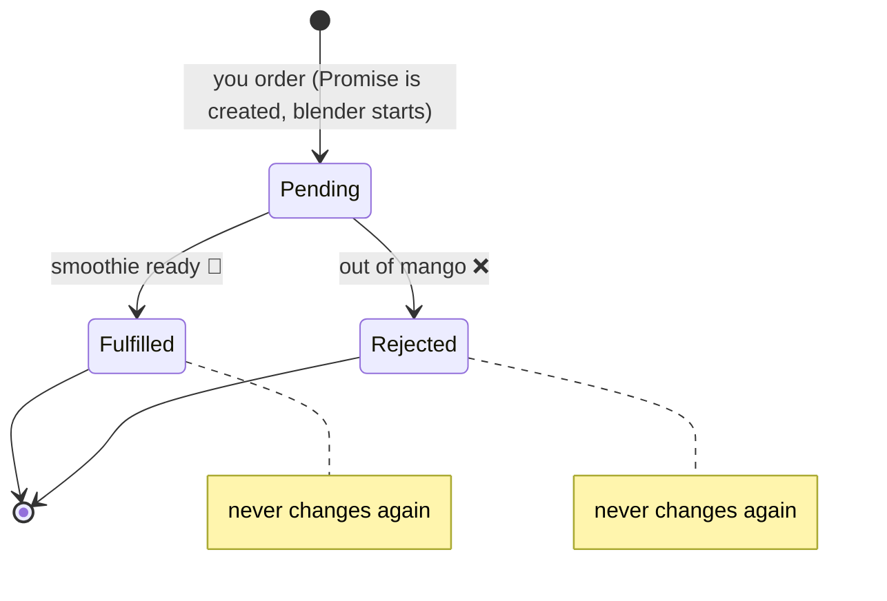

# Lesson 2: Promises, the Receipt

## The big idea

**A Promise is a receipt for a value that isn't ready yet.** You order a smoothie, you get a
receipt, and the receipt says "your smoothie will be here soon, or we'll tell you why not."

## The story

You walk up to the smoothie counter and order a mango smoothie. They don't hand you a smoothie.
They hand you a **receipt** with a number on it. The receipt is not the smoothie. It's a promise of one.

Three things can be true about that receipt at any moment:

- **Pending**: still blending. You're holding the receipt, waiting.
- **Fulfilled**: your number is called, here's your smoothie. The receipt "turned into" the value.
- **Rejected**: "Sorry, we're out of mango." The receipt turned into a reason it failed.

Once a receipt is fulfilled or rejected, it never changes again. A smoothie doesn't un-blend.

Important and sneaky: **the blender starts the moment you order.** You don't have to do anything
to start it. Holding the receipt doesn't start or stop anything. Remember this. Lesson 3 hinges on it.

## The picture



## What you can do with a receipt

You can write instructions on the back of it:

- `.then(...)` means *"when it's ready, do this with it."*
- `.catch(...)` means *"if it fails, do this instead."*

```ts
orderSmoothie("mango")
  .then((smoothie) => console.log("Yum:", smoothie))
  .catch((reason) => console.log("Oh no:", reason))
```

## async and await: writing it like a normal story

Writing everything in `.then` chains gets awkward. So JavaScript lets you write it top to bottom:

```ts
async function lunch() {
  const smoothie = await orderSmoothie("mango")   // wait here, but Sam stays busy elsewhere
  console.log("Yum:", smoothie)
}
```

- `async` on a function means: *"this function hands back a receipt, not the answer."*
- `await` means: *"pause this story until the receipt is fulfilled, then continue."*
  The cook is **not** frozen while we wait. Other tickets still get done. It's only *this story* that pauses.

If the receipt is rejected, `await` throws, and you catch it with a normal `try/catch`:

```ts
async function lunch() {
  try {
    const smoothie = await orderSmoothie("mango")
    console.log("Yum:", smoothie)
  } catch (reason) {
    console.log("Oh no:", reason)
  }
}
```

## Three things a receipt can't tell you

Hold up a real receipt and ask the class: what's *missing*?

1. **It doesn't say what can go wrong.** The receipt says "smoothie" but not "might be out of mango."
   In code, a `Promise<Smoothie>` tells you the happy answer and *nothing* about failures.
   The `catch` gets a mystery box.
2. **You can't reorder from the same receipt.** A receipt is for one smoothie, already started.
   Want another? New order, new receipt.
3. **You can't cancel it.** Once you've ordered, the blender runs. Walk away and the smoothie still gets made.

Write these three on the board and leave them up. Lesson 3 fixes all three.

## Check yourself

1. Is the receipt the smoothie? What is it, then?
2. When does the blender start: when you order, or when you read the receipt?
3. What are the three states a receipt can be in? Can it go from Fulfilled back to Pending?
4. Your friend says "await freezes the whole program." Use the kitchen to explain why they're wrong.

## Teacher notes

- A Promise **is** a real JavaScript thing you can `console.log`. Show one: `console.log(orderSmoothie("mango"))`
  prints `Promise { <pending> }`. Kids love seeing the word "pending" for real.
- Reinforce that `async/await` is *only* a nicer way to write `.then`. Nothing new happens under the hood.
- The "three things a receipt can't tell you" list is the bridge to Effect. If you have to cut
  something from this lesson, don't cut that.
- For the demo, a fake `orderSmoothie` is enough:

```ts
const orderSmoothie = (flavor: string) =>
  new Promise<string>((resolve, reject) => {
    setTimeout(() => {
      if (flavor === "mango") resolve("mango smoothie 🥤")
      else reject("out of " + flavor)
    }, 1000)
  })
```
