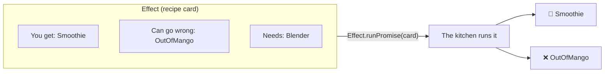

# Lesson 3: Effects, the Recipe Card

## The big idea

**An Effect is a recipe card, not a meal.** It describes what to do. Nothing happens until you hand
the card to the kitchen and say "run it." And the card has three lines on it that a receipt never had.

## The story

Remember the receipt from Lesson 2? The blender started the moment you ordered. You couldn't
reorder from it, couldn't cancel it, and it didn't say what could go wrong.

Now imagine instead of a receipt, the counter hands you a **recipe card**:

```
┌──────────────────────────────────────────┐
│  MANGO SMOOTHIE                           │
│                                           │
│  You get:        a Smoothie               │
│  Can go wrong:   OutOfMango               │
│  Needs:          a Blender                │
│                                           │
│  Steps: get mango, get ice, blend 30 sec  │
└──────────────────────────────────────────┘
```

A card is just paper. Holding it makes no smoothie. You can read it, photocopy it, staple it to
another card, or hand it to the kitchen. **Only handing it to the kitchen makes a smoothie.**
Programmers say you **run** the effect.

That one difference fixes all three receipt problems:

| Receipt (Promise) | Recipe card (Effect) |
|---|---|
| Starts the moment it's made | Starts only when you run it |
| One use | Run it as many times as you like |
| Doesn't say what can go wrong | Has a "Can go wrong" line |
| Doesn't say what it needs | Has a "Needs" line |

## The picture



The three lines are the three parts of the type. In TypeScript it's written like this:

```ts
Effect<Smoothie, OutOfMango, Blender>
//     ^ you get  ^ can go wrong  ^ needs
```

Say it as a sentence every time: *"An Effect that gives you a Smoothie, might fail with OutOfMango, and needs a Blender."*

When nothing can go wrong, the middle slot says `never`. When it needs nothing, the last slot says `never`.
`never` means **"nothing here."** So `Effect<number, never, never>` is "gives you a number, nothing can go wrong, needs nothing."
Effect lets you leave off trailing `never`s, so that's usually written `Effect<number>`.

## The tiniest code

```ts
import { Effect, Console } from "effect"

// Making a card. NOTHING RUNS YET.
const sayHi = Console.log("hi!")           // Effect<void>

// Still nothing runs. We're just stapling two cards together into one.
const sayHiTwice = Effect.andThen(sayHi, sayHi)

// NOW it runs.
Effect.runPromise(sayHiTwice)              // prints "hi!" twice
```

Compare with a Promise: `console.log("hi!")` prints immediately. There is no "card" step.

## Writing a recipe with steps: Effect.gen

Real recipes have several steps. `Effect.gen` lets you write them top to bottom, like the `async/await`
story from Lesson 2. The magic word is `yield*`, which you read as **"do this step and hand me the result."**

```ts
import { Effect, Console } from "effect"

const getMango = Effect.succeed("🥭")          // a card that always gives a mango
const getIce   = Effect.succeed("🧊")          // a card that always gives ice

const smoothie = Effect.gen(function* () {
  const mango = yield* getMango                 // do this step, hand me the mango
  const ice   = yield* getIce                   // do this step, hand me the ice
  yield* Console.log(`blending ${mango} + ${ice}`)
  return "🥤"                                   // the "You get" line
})
// smoothie : Effect<string>   (gives a string, nothing can go wrong, needs nothing)

Effect.runPromise(smoothie).then(console.log)   // blending 🥭 + 🧊  then  🥤
```

The `function*` with a star is a **generator**. You don't need to know what that means this month.
Treat `Effect.gen(function* () { ... })` as "here begins a recipe" and `yield*` as "do this step."

Notice: `smoothie` is still just a card. You could run it a hundred times and get a hundred smoothies.

## Check yourself

1. You have `const s = makeSmoothie()` where `makeSmoothie` returns an Effect. Has a smoothie been made?
2. Read this out loud as a sentence: `Effect<Toast, BreadIsMoldy, Toaster>`.
3. What does `never` mean in the middle slot? In the last slot?
4. Why can you run the same Effect twice, but not "re-await" the same Promise to get a second smoothie?

## Teacher notes

- The phrase to repeat: **"plan, not action."** Have students say it when they see `Effect.` and
  "action" when they see `Effect.runPromise`.
- Some students will ask why anyone wants a card instead of the meal. The honest answer is:
  cards can be checked before cooking. A teacher can look at the card and say "you forgot to handle
  OutOfMango" before anyone turns on a blender. That's what TypeScript does. Lesson 4 shows it.
- `Effect.succeed(x)` makes a card that just hands you `x`. `Effect.fail(e)` makes a card that just
  fails with `e`. Those two plus `Effect.gen` are enough to build everything in this unit.
- `Effect.runPromise` gives back a Promise, so the "card" world plugs into the "receipt" world at
  the very edge of the program. Draw it: a big box of cards, and one `runPromise` door out the side.
- Real programs use `Effect.runPromise` exactly once, at the door. Everything inside is cards.
