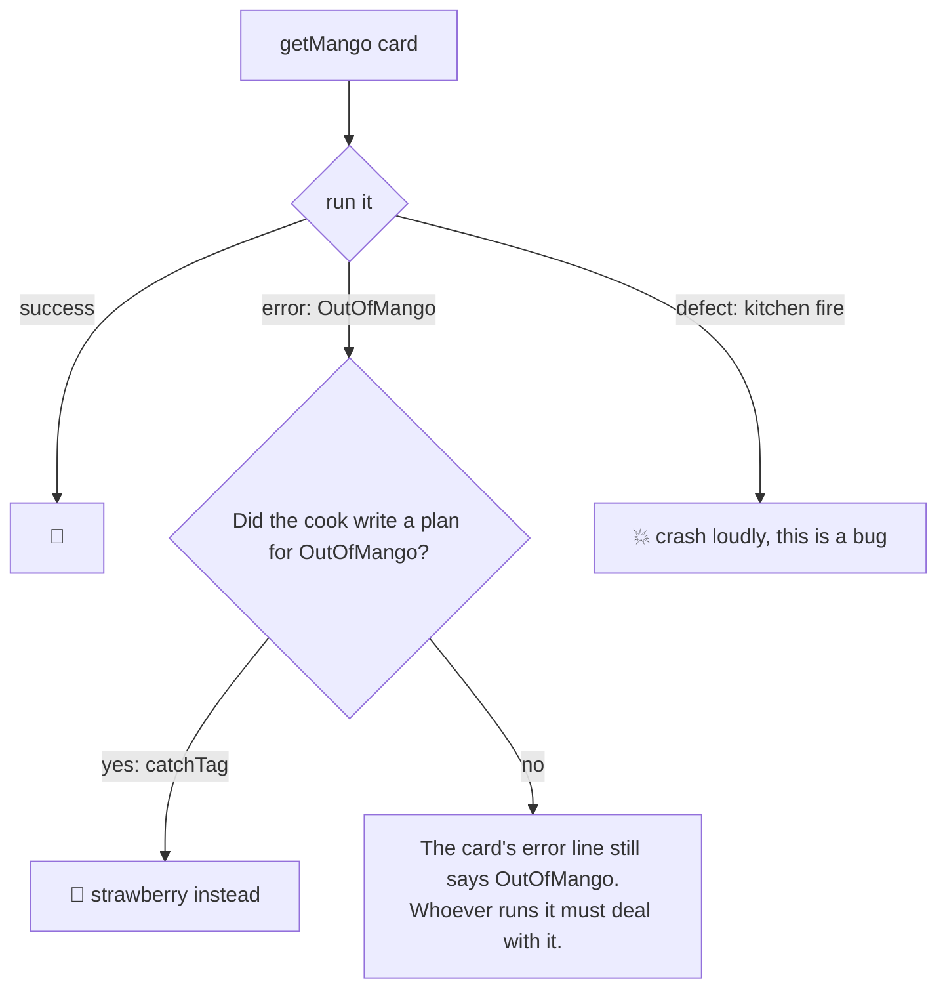
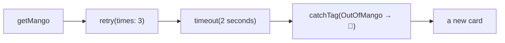

# Lesson 4: Errors You Can See

## The big idea

**The card says what can go wrong, so the compiler makes you deal with it.** Effect also separates
"problems we expected" from "the kitchen caught fire," and gives you tools like retry and timeout
that snap onto any card.

## The story

Two very different things can go wrong at the smoothie counter:

1. **Out of mango.** Annoying, but normal. It's *going to happen* sometimes. A good recipe card
   lists it on the "Can go wrong" line, and a good cook has a plan: offer strawberry instead.
2. **The kitchen catches fire.** Nobody writes "kitchen fire" on a smoothie recipe. It's not a
   smoothie problem, it's a *bug* in the building. You don't "handle" it with a strawberry.

Effect calls the first kind an **error** (expected, written on the card) and the second kind a
**defect** (unexpected, a bug). The compiler makes you deal with errors. Defects crash loudly,
which is what you want, because hiding a fire is worse than seeing it.

## Name tags for errors

Each expected error gets a **name tag** so you can tell them apart:

```ts
import { Data } from "effect"

class OutOfMango extends Data.TaggedError("OutOfMango") {}
class BlenderJammed extends Data.TaggedError("BlenderJammed")<{ readonly speed: number }> {}
```

That's a whole error type. The string in quotes is the name tag. Now a card can list them:

```ts
import { Effect } from "effect"

const getMango = Effect.gen(function* () {
  if (Math.random() < 0.3) {
    return yield* Effect.fail(new OutOfMango())     // the "can go wrong" line
  }
  return "🥭"
})
// getMango : Effect<string, OutOfMango>
//                           ^ TypeScript figured this out on its own
```

Nobody wrote `OutOfMango` in the type. TypeScript *read the recipe* and filled in the "Can go wrong" line by itself.

## The picture: a card going through the kitchen



## Catching one specific error

```ts
const getFruit = getMango.pipe(
  Effect.catchTag("OutOfMango", () => Effect.succeed("🍓"))
)
// getFruit : Effect<string>      <-- OutOfMango is GONE from the error line
```

Look at what happened to the type. Before: `Effect<string, OutOfMango>`. After: `Effect<string>`.
The compiler saw that we wrote a plan for `OutOfMango` and **crossed it off the card.**
If a card still has errors on it when you reach `Effect.runPromise`, that's your reminder that
you haven't planned for them.

`Effect.catch` (no tag) is the "catch anything on the error line" version. Notice it still doesn't
catch defects. Fires are not on the error line.

## Two tools that snap onto any card

Because a card is just a plan, you can wrap a plan around a plan. Two favorites:

**Retry.** "If it fails, try again, up to 3 more times."

```ts
const stubbornMango = Effect.retry(getMango, { times: 3 })
```

**Timeout.** "Give up if it takes longer than 2 seconds." The card's error line grows:
now it can also fail with a timeout error.

```ts
const quickMango = Effect.timeout(getMango, "2 seconds")
// quickMango : Effect<string, OutOfMango | TimeoutError>
```

Try doing *that* to a Promise. You can't wrap a plan around a receipt, because the receipt already started.



Each box is still just a card. Nothing has run.

## Check yourself

1. "Out of mango" versus "kitchen fire": which one belongs on the recipe card, and why?
2. Before `catchTag`, the type was `Effect<string, OutOfMango>`. After, it was `Effect<string>`. Who crossed the error off, and how did they know they could?
3. Why can you wrap `retry` around an Effect but not around a Promise?
4. `Effect.timeout` *adds* an error to the card. Does that seem like a bad thing? (No: it's being honest.)

## Teacher notes

- The single most important moment in this unit is showing the error type **disappear** when
  you add `catchTag`. Do it live with hover-over types in the editor. Let them see the red squiggle
  when they forget.
- `Data.TaggedError("Name")` makes a class with a `_tag` field. The `_tag` is literally the name tag.
  You can `console.log(err._tag)` to prove it.
- Defects come from things like `throw` inside plain code, or `Effect.die`. You *can* catch them
  with `Effect.catchDefect`, but tell students that's for the "fire alarm" layer of the program, not recipes.
- `Effect.retry` accepts a `Schedule` too (`Schedule.exponential("100 millis")`, for instance),
  which is "wait a bit longer between each try." Mention it, don't teach it.
- Ask students to write down the "Can go wrong" line for something from their own lives: logging
  into a game (WrongPassword, ServerDown, TooManyAttempts). This makes it click that errors are
  a *list of known things*, not "stuff happened."
