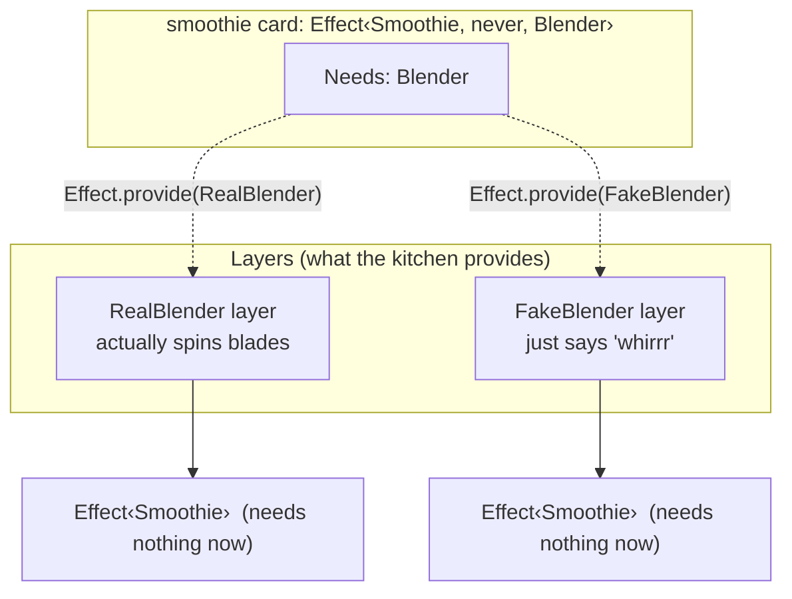
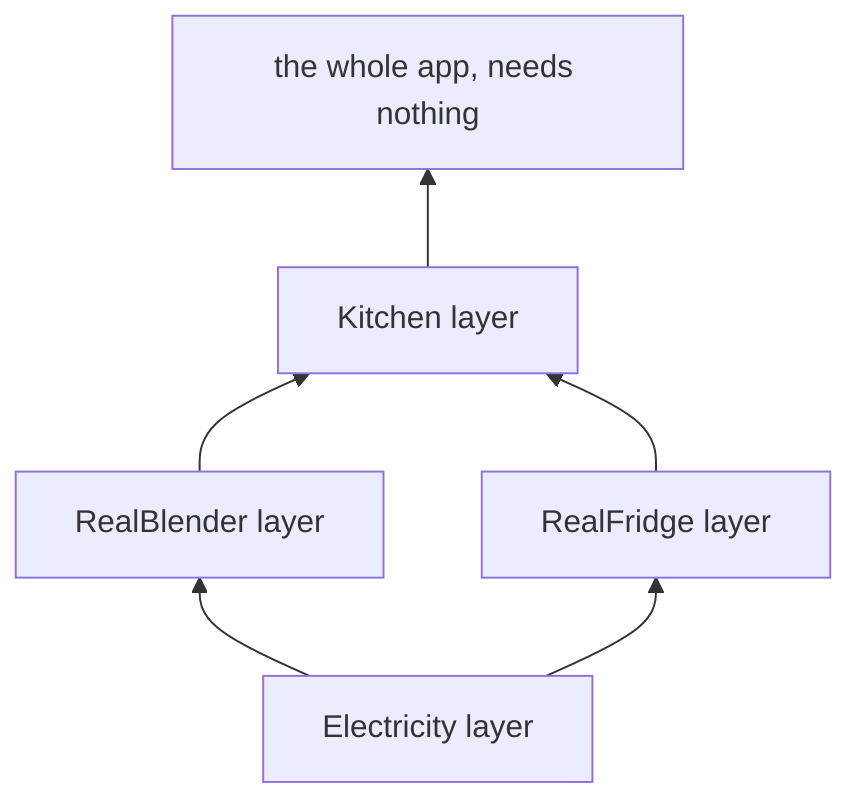

# Lesson 5: Asking for Help, Services and Layers

## The big idea

**A recipe says what it needs. The kitchen supplies it.** The recipe for a smoothie says "Needs: a
blender." It does not say *which* blender, and it definitely doesn't build one. That's the third line
on the card, and it's what makes recipes testable and swappable.

## The story

The smoothie recipe says "blend for 30 seconds." It doesn't say "go buy a Blendtec 575." Any blender
will do. On the day, the kitchen hands the cook whichever blender it has.

This is great for two reasons:

1. **Practice kitchen.** When teaching a new cook, you give them a *pretend* blender that just says
   "whirrr" and hands back a smoothie instantly. Same recipe, no mess. Programmers call this a **test**.
2. **Swapping.** When the old blender dies, you buy a new one. The recipe doesn't change.

In Effect, a thing a recipe needs is called a **service**. The way the kitchen supplies it is called a **layer**.

## The picture



The moment you provide the blender, the "Needs" line becomes `never`, meaning "nothing." The card is now
runnable.

## The tiniest code

Step 1: describe the service. Just the *shape*, what a blender can do. No real blender yet.

```ts
import { Context, Effect } from "effect"

class Blender extends Context.Service<Blender, {
  readonly blend: (stuff: string) => Effect.Effect<string>
}>()("Blender") {}
```

Read it as: "There is a service called Blender. Any Blender must have a `blend` step."

Step 2: write a recipe that *asks* for a Blender.

```ts
const smoothie = Effect.gen(function* () {
  const blender = yield* Blender                 // "hand me whatever Blender the kitchen has"
  return yield* blender.blend("🥭 + 🧊")
})
// smoothie : Effect<string, never, Blender>
//                                  ^ the "Needs" line, filled in by TypeScript
```

`yield* Blender` is the cook holding out a hand and saying "blender, please." The recipe never says which one.

Step 3: build a real one and a pretend one. These are **layers**.

```ts
import { Layer, Console } from "effect"

const RealBlender = Layer.succeed(Blender, {
  blend: (stuff) => Console.log("WHIRRRR " + stuff).pipe(Effect.as("🥤"))
})

const FakeBlender = Layer.succeed(Blender, {
  blend: (_stuff) => Effect.succeed("🥤 (pretend)")
})
```

Step 4: provide one and run.

```ts
Effect.runPromise(smoothie.pipe(Effect.provide(RealBlender)))   // WHIRRRR 🥭 + 🧊  →  🥤
Effect.runPromise(smoothie.pipe(Effect.provide(FakeBlender)))   // 🥤 (pretend)
```

Same recipe. Two kitchens.

If you forget step 4 and try `Effect.runPromise(smoothie)` directly, TypeScript refuses: the card still
says "Needs: Blender" and the kitchen hasn't got one. That's the compiler being your kitchen manager.

## Layers stack

A real kitchen needs a blender *and* a fridge *and* a sink. Layers combine:

```ts
const Kitchen = Layer.mergeAll(RealBlender, RealFridge)
Effect.runPromise(bigRecipe.pipe(Effect.provide(Kitchen)))
```

And a layer can itself need things (a Blender layer that needs Electricity). We don't go there this month,
but it's the same idea one level up: layers are recipes for building appliances.



## Check yourself

1. The smoothie recipe says "Needs: Blender." Does it say which blender? Why is that good?
2. What's the point of a pretend blender?
3. After `Effect.provide(RealBlender)`, what does the "Needs" line say? What word is that?
4. You try to run the card without providing a blender. Who stops you, and when: before or after the blender would have spun?

## Teacher notes

- The grown-up term is **dependency injection**. Don't say it. "The recipe asks, the kitchen provides" is exactly the same idea.
- `Context.Service<Self, Shape>()("Name")` has an odd double-parentheses shape. Tell students
  to copy it exactly and not worry; it's a TypeScript quirk, not an Effect idea.
- `Effect.as("🥤")` just means "throw away whatever came out, hand back this instead."
- `Layer.succeed(Tag, implementation)` is "here's a ready-made appliance." `Layer.effect(Tag, effect)`
  is "here's a recipe for building the appliance," for when building it can fail or needs other things.
- Good in-class exercise: have half the room write a `Fridge` service with `take(item)` that can fail
  with `OutOf(item)` (Lesson 4!), and the other half write the two layers for it.
