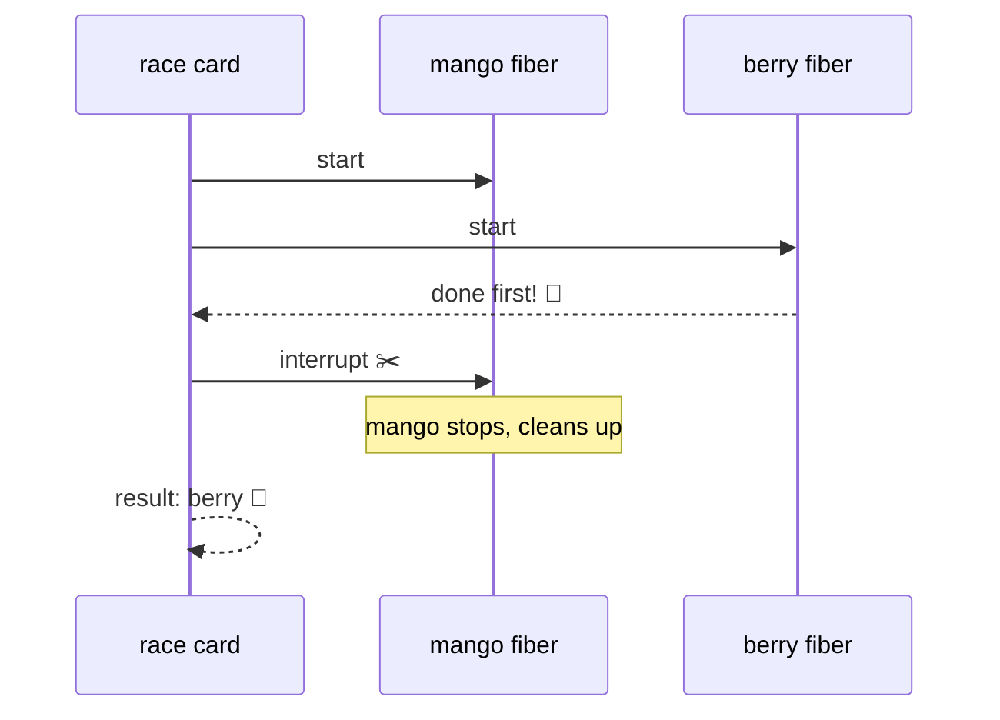

# Lesson 6: Many Things at Once, Fibers

## The big idea

**One cook can keep many recipes going by using bookmarks, and can cleanly stop any of them.**
Effect calls a bookmark in a running recipe a **fiber**. Fibers let you run recipes side by side,
race them, and interrupt them, which Promises can't do.

## The story

Remember: still one cook, Sam. Sam is making three smoothies for three customers.

Sam does not grow extra arms. Sam puts a **bookmark** in recipe 1 while it blends, starts recipe 2,
bookmarks that, starts recipe 3. Whenever a blender bell rings, Sam goes back to that bookmark and
continues from there. Three recipes in progress, one cook, three bookmarks.

Each bookmark is a fiber. It remembers *where in the recipe we were* so Sam can pick it back up.

Now the good part. Customer 2 leaves. With a Promise (a receipt), too bad, the smoothie gets made anyway.
With a fiber, Sam **pulls the bookmark out** and stops that recipe. Effect calls this **interruption.**
And, as Lesson 7 will show, any cleanup that recipe promised to do (turn off the blender) still happens.

## The picture

```mermaid
gantt
    title One cook, three fibers
    dateFormat  s
    axisFormat  %S s
    section Recipe 1
    get fruit          :a1, 0, 1s
    blending (waiting) :a2, after a1, 3s
    pour               :a3, after a2, 1s
    section Recipe 2
    get fruit          :b1, after a1, 1s
    blending (waiting) :b2, after b1, 3s
    INTERRUPTED  ✂️     :crit, b3, after b2, 1s
    section Recipe 3
    get fruit          :c1, after b1, 1s
    blending (waiting) :c2, after c1, 3s
    pour               :c3, after c2, 1s
```



Sam only *works* during "get fruit" and "pour." During "blending," the blender does the work and Sam is elsewhere.
That's why three smoothies take about five seconds, not fifteen.

## The tiniest code

**Run several cards at once.** `Effect.all` takes a list of cards and gives back one card that
produces a list of results. The `concurrency` option is "how many bookmarks may Sam have open at once."

```ts
import { Effect } from "effect"

const makeSmoothie = (name: string) =>
  Effect.sleep("3 seconds").pipe(Effect.as(`${name} 🥤`))

const three = Effect.all(
  [makeSmoothie("mango"), makeSmoothie("berry"), makeSmoothie("kiwi")],
  { concurrency: "unbounded" }      // as many bookmarks as needed
)
// three : Effect<string[]>

Effect.runPromise(three).then(console.log)   // ~3 seconds, not 9
```

Change `"unbounded"` to `1` and it takes nine seconds. Change it to `2` and see what happens. Ask the class to predict first.

**Race.** Two cards start; the first to finish wins, and the loser is interrupted (its bookmark is pulled).

```ts
const fastest = Effect.race(makeSmoothie("mango"), makeSmoothie("berry"))
```

**A bookmark you can hold.** `Effect.forkChild` starts a card in the background and hands you the fiber.
`Fiber.join` waits for it. `Fiber.interrupt` stops it.

```ts
import { Effect, Fiber, Console } from "effect"

const program = Effect.gen(function* () {
  const fiber = yield* Effect.forkChild(makeSmoothie("mango"))   // start it, keep the bookmark
  yield* Console.log("customer is waiting...")
  yield* Effect.sleep("1 second")
  yield* Console.log("customer left!")
  yield* Fiber.interrupt(fiber)                                  // pull the bookmark
  yield* Console.log("stopped the mango smoothie")
})

Effect.runPromise(program)
```

Try that with a Promise. There is no way to stop `orderSmoothie("mango")` once it's called.

## The picture: race



## Check yourself

1. Did Sam ever do two things at the exact same instant? Then how did three smoothies take three seconds?
2. What is a fiber, in kitchen words?
3. A customer leaves. What happens to their smoothie with a Promise? With a fiber?
4. In `Effect.all` with `concurrency: 2`, how long do three 3-second smoothies take? (Answer: about 6 seconds. Draw it.)

## Teacher notes

- The word for "many things in progress at once" is **concurrency**. It is *not* the same as
  "many things happening at the same instant," which is parallelism, which needs more cooks. JavaScript
  has one cook. Say "in progress," never "at the same time," and you'll avoid a year of confusion.
- `Effect.forkChild` makes the fiber a *child* of the current one. If the parent finishes or is
  interrupted, the child is interrupted too. That's why it's called "child." Effect 4 also has
  `forkScoped` and `forkDetach` for other lifetimes; skip them.
- The `concurrency` option accepts a number or `"unbounded"`. Leaving it out means one at a time.
- Interruption is polite. A fiber isn't killed mid-instruction; it stops at the next step boundary
  and runs its cleanup (Lesson 7). Compare to pulling a plug versus pressing the off button.
- If a kid asks about `Effect.runFork`: it's `runPromise`'s sibling that hands you back the top-level
  fiber instead of a Promise. Same "door out of the kitchen" idea.
