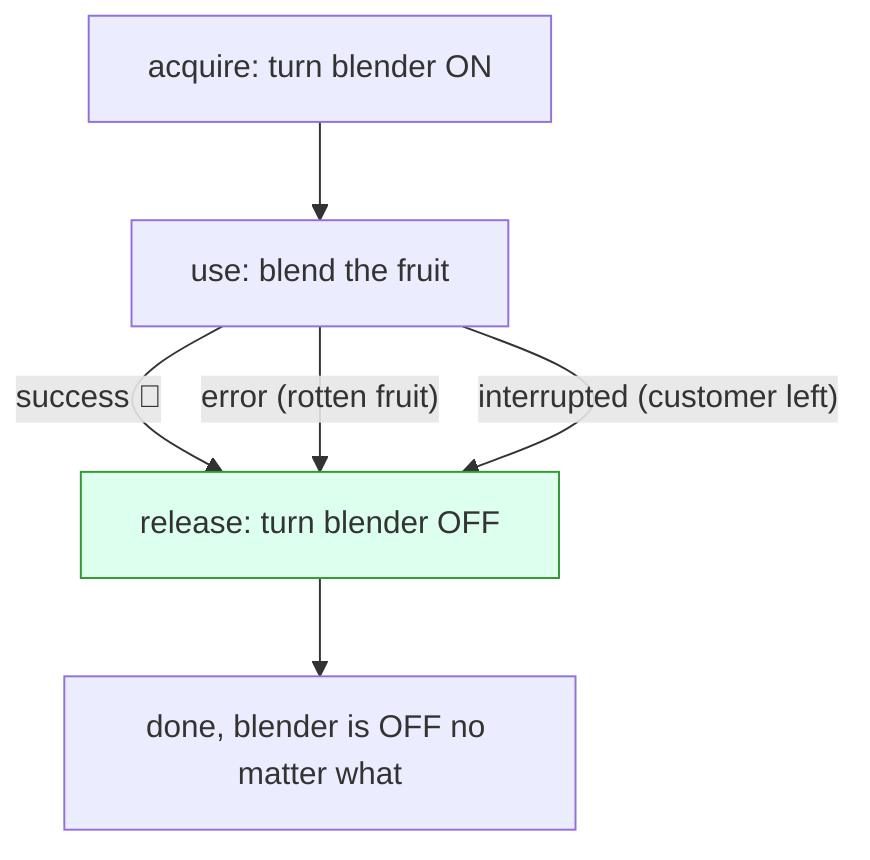

# Lesson 7: Cleaning Up

## The big idea

**Whatever you borrow, you give back, even when things go wrong.** Effect has a built-in rule for
"get a thing, use it, always put it back," and it holds no matter how the recipe ends: success,
error, or interruption.

## The story

You check a book out of the library. Three ways your afternoon can go:

1. You read it and return it. 
2. You spill juice on chapter three, and you still have to return it.
3. Your parent calls and says "come home NOW," and you *still* have to return it.

The return is not optional. It doesn't care why you stopped reading.

Kitchen version: you turn on the blender. Whether the smoothie succeeds, the fruit was rotten, or
the customer left and the recipe was interrupted, **the blender gets turned off.** A blender left running
overnight is how kitchens burn down.

Effect calls this pattern **acquire and release**, and the guarantee is: *release always runs.*

## The picture



Every arrow out of "use" goes through "release." There is no path that skips it.

## The tiniest code

```ts
import { Effect, Console } from "effect"

const blenderOn  = Console.log("blender ON  🔛")
const blenderOff = Console.log("blender OFF ⏹️")

const useBlender = Effect.acquireRelease(
  blenderOn,            // acquire
  () => blenderOff      // release: ALWAYS runs
)

const smoothie = Effect.gen(function* () {
  yield* useBlender
  yield* Console.log("blending...")
  yield* Effect.fail(new Error("rotten fruit!"))   // uh oh
  yield* Console.log("pouring")                    // never reached
})

Effect.runPromise(Effect.scoped(smoothie)).catch(() => {})
// blender ON  🔛
// blending...
// blender OFF ⏹️        <-- ran anyway
```

Delete the `Effect.fail` line and you'll see ON, blending, pouring, OFF. Put it back: ON, blending, OFF.
Either way, OFF.

## What's Effect.scoped?

The library book has a *due date*: how long you're allowed to keep it. Effect calls that window a
**scope**. `Effect.acquireRelease` adds "Needs: a Scope" to the card's third line, because the card
needs to know *when* to return things. `Effect.scoped` says "the scope is this recipe: return everything
when it ends." Layers (Lesson 5) also make scopes, so a blender acquired in a layer is returned when the
app shuts down.

You do not need to understand scopes deeply this month. You need: **acquireRelease borrows, scoped sets the due date, release always happens.**

## Why this is a big deal

With a Promise, there's no "interrupted" path at all, so people forget cleanup on the "customer left"
case, because that case doesn't exist for them. Then a real program runs for a week and has ten thousand
blenders still on. Effect makes the interrupted path a first-class thing, and cleanup runs on it too.

## Check yourself

1. Name the three ways a recipe can end. Which of them skips the release step?
2. Why is "turn the blender off" *not* just the last line of the recipe? (Hint: what if line 3 fails?)
3. In library words, what's a scope?
4. A friend says "I'll just put cleanup in the `.catch` of my Promise." What case did they forget?

## Teacher notes

- `acquireRelease(acquire, release)` returns the acquired thing, so you can do
  `const blender = yield* useBlender` and then use it. The example throws it away for simplicity.
- `Effect.ensuring(cleanup)` is the simpler cousin: "after this card, always run cleanup."
  `Effect.addFinalizer` registers cleanup from inside a `gen` block. Both are fine to mention.
- A nice closer for the unit: draw the full smoothie card on the board with all three lines filled
  in, a `retry` and `timeout` wrapped around it, a `Blender` layer provided, and `acquireRelease`
  keeping the blender safe. Then ask: "What can go wrong that we haven't written down?" The honest
  answer, "a defect, and we'd see it loudly," is the whole philosophy in one sentence.
